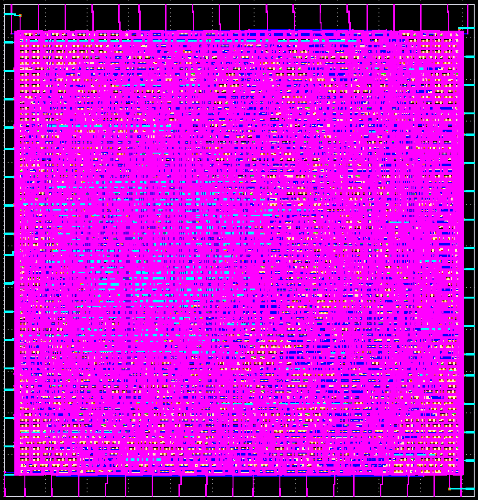
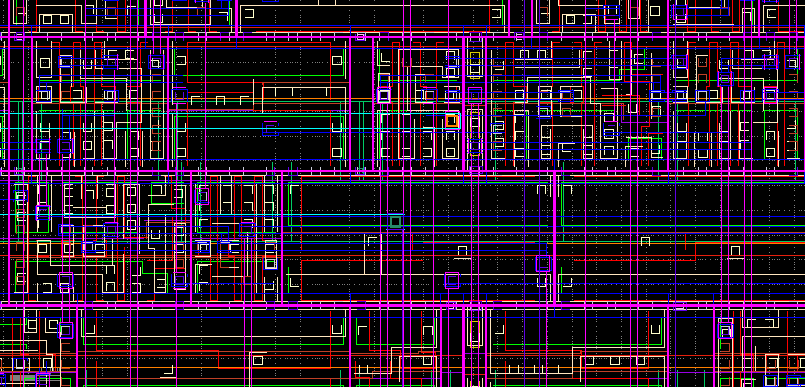

# 16-Bit MAC Physical Design & Design Space Exploration (DSE)
### SkyWater 130nm ASIC Implementation using OpenLane & OpenROAD Flow


---

## 📌 Executive Summary

This repository presents the end-to-end Physical Design (RTL-to-GDSII) and Sign-off verification of a **16-bit Multiply-Accumulate (MAC)** unit implemented in **SkyWater 130nm High-Density CMOS technology (`sky130_fd_sc_hd`)**. 

Rather than adopting standard default tool flows, an in-depth **Design Space Exploration (DSE)** across three target core utilization levels (**45% → 60% → 70%**) was executed to characterize Physical Performance, Power, and Area (PPA) trade-offs, clock-tree balancing, hold-time mitigation dynamics, and the manufacturing boundaries (*Congestion Cliff*) of this architecture.

The **60% utilization variant** was successfully qualified as the **Golden Tape-out Candidate**, delivering a **23.26% silicon area reduction** while achieving complete dual-engine DRC (Magic & KLayout), Netgen LVS, Antenna sign-off, and setup timing closure at 100 MHz with $+1.35\text{ ns}$ margin.

---

## 📸 Physical Implementation Showcase

| Full Die Layout (60% Optimal Utilization) | Detailed Standard Cells & Routing Macro |
| :---: | :---: |
|  |  |
| *Macro boundary (prBoundary), power rings, and balanced pin routing.* | *Active diffusion, poly gates, orthogonal routing (li1, met1, met2), and antenna diodes.* |

---

## 🎯 Architecture & Implementation Constraints

* **Core Function:** 16-bit signed/unsigned Multiply-Accumulate ($Y = A \times B + C$).
* **Synthesized Complexity:** 2,199 standard cells (`sky130_fd_sc_hd`).
* **Clock Constraints:** Target Period $T_{\text{clk}} = 10.0\text{ ns}$ ($100\text{ MHz}$), Clock Uncertainty $= 0.25\text{ ns}$, Input External Delay $= 2.0\text{ ns}$.
* **Supply Voltages:** $V_{\text{DD}} = 1.8\text{ V}$, $V_{\text{SS}} = 0\text{ V}$.
* **Sign-off Tools:** OpenSTA (Timing & SPEF Parasitics), Magic & KLayout (DRC), Netgen (LVS), OpenROAD Antenna Checker.

---

## 📊 Design Space Exploration (DSE Matrix)

The following table aggregates the post-layout sign-off metrics extracted across three density runs:

| Design Metric / Sign-off Check | Run 1: Baseline (45%) | Run 2: Optimal (60%) | Run 3: Stress-Test (70%) | Physical Impact / Engineering Analysis |
| :--- | :---: | :---: | :---: | :--- |
| **Die Area** | $0.0533\text{ mm}^2$ | **$0.0409\text{ mm}^2$** | $0.0355\text{ mm}^2$ | **-23.26%** silicon footprint reduction at 60% |
| **Effective Core Utilization**| $46.97\%$ | **$62.45\%$** | $72.92\%$ | Placement density achieved |
| **Total Wirelength** | $72,325\ \mu\text{m}$ | **$68,148\ \mu\text{m}$** | $68,105\ \mu\text{m}$ | **-5.77%** shorter interconnects (-4.17 mm total wire) |
| **Synthesized Gate Count** | 2,199 cells | 2,199 cells | 2,199 cells | Identical functional gate count across runs |
| **Setup Slack (WNS)** | $+0.00\text{ ns}$ | **$+1.35\text{ ns}$ (MET)** | $+0.00\text{ ns}$ | Met $100\text{ MHz}$ target ($F_{\text{max}} \approx 115.6\text{ MHz}$) |
| **Hold Violations & Repair** | 0 | **13 Buffers Added** | 0 (Resolved) | Auto-resolved fast paths caused by compact placement |
| **Magic DRC Violations** | 0 | **0** | 0 | Clean physical geometry |
| **KLayout Manufacturing DRC**| Clean | **Clean (`<items></items>` empty)** | Clean | Verified against `sky130A_mr.drc` rule deck |
| **Netgen LVS Matching** | Clean (2,399 nets) | **Clean (2,427 nets)** | Clean (2,399 nets) | 100% topological netlist correspondence |
| **Antenna Violations** | 0 | **0** | **1 Pin / 1 Net** | Fails at 70% due to local whitespace starvation |
| **Engineering Verdict** | Over-margined | **GOLDEN TAPE-OUT** | Congestion Cliff | 60% is the optimal manufacturable sweet spot |

---

## 🔬 In-Depth Engineering & Physical Trade-off Analysis

### 1. The 60% Sweet Spot: Silicon Area vs. Hold Timing Dynamics
* **Area & Parasitic Reduction:** Increasing utilization from 45% to 60% condensed the die area down to $0.0409\text{ mm}^2$, shrinking the total routing wirelength by $4.17\text{ mm}$ ($5.77\%$). This directly lowers total net capacitance and reduces dynamic switching power ($P_{\text{dyn}} = \alpha C V^2 f$).
* **Hold Timing Repair Intervention:** Compacting standard cells into closer proximity shortened interconnect lengths between registers, accelerating data path arrival relative to clock skew. This introduced 14 hold-time violations post-CTS. The OpenROAD Resizer automatically legalized **13 hold buffers**, splitting nets and shifting the total net count from 2,399 to 2,427 without creating routing congestion.

### 2. The 70% Limit: Whitespace Starvation & Antenna Effects
* When stressed to 70% utilization, the placement core reached $72.92\%$ actual density. At this boundary, the design hit **Whitespace Starvation**.
* **Antenna Root Cause:** The global router accumulated plasma charge along a long metal segment connected to the inverted input pin `B_N` of standard cell `_3981_` (`sky130_fd_sc_hd__or2b_1` on Net `_1112_`).
* **Why Heuristic Diode Insertion (Strategy 4) Failed:** The surrounding standard cell rows were packed at 100% capacity with zero vacant layout sites nearby. The diode inserter could not place a `sky130_fd_sc_hd__diode_2` cell close enough to the gate without creating DRC overlap errors.
* **Conclusion:** 60% core utilization represents the strict physical manufacturing boundary for this architecture on Sky130 standard cell pitches.

---

## ⏱️ Static Timing & Clock Tree Synthesis (STA/CTS) Sign-off

The optimal 60% candidate was verified using OpenSTA with multi-corner **100% SPEF parasitic back-annotation** (`0 unannotated drivers`):

### 1. Critical Path Analysis (Setup Check - Typical Corner)
* **Startpoint:** `in_b[5]` (external input clocked by `clk`)
* **Endpoint:** `_4322_` (rising edge-triggered D-Flip-Flop clocked by `clk`)
* **Data Path Delay:** 25 logic stages (`buf` $\rightarrow$ `clkbuf` $\rightarrow$ `nor2` $\rightarrow$ `a21o` $\rightarrow$ `xor2` $\rightarrow$ `inv` $\rightarrow$ `mux2` $\rightarrow$ `dfrtp`).

$$\text{Data Arrival Time} = 8.63\text{ ns}$$
$$\text{Data Required Time} = T_{\text{clk}} (10.0\text{ ns}) + \text{Clock Latency} (0.33\text{ ns}) - \text{Uncertainty} (0.25\text{ ns}) - \text{Setup} (0.10\text{ ns}) = 9.98\text{ ns}$$
$$\mathbf{Setup\ Slack} = 9.98\text{ ns} - 8.63\text{ ns} = \mathbf{+1.35\text{ ns}\ (MET)}$$

The $+1.35\text{ ns}$ positive slack provides a **$13.5\%$ timing margin**, ensuring robust operation against on-chip variations (OCV) and allowing frequency scaling up to **$115.6\text{ MHz}$**.

### 2. Clock Tree Balancing (CTS Quality)
* **Clock Skew:** **$-0.03\text{ ns}$ ($30\text{ ps}$)** between launch and capture registers (`_4270_/CLK` vs `_4292_/CLK`). At $100\text{ MHz}$, skew accounts for only **$0.3\%$ of the clock period** (industry standard requires $< 5\%$).
* **Clock Insertion Latency:** $0.26\text{ ns} - 0.29\text{ ns}$, minimizing clock tree buffer depth, dynamic clock tree power, and susceptibility to local IR-drop fluctuations.
* **Electrical Design Rule Violations (DRVs):**
  * `max slew violation count`: **0**
  * `max cap violation count`: **0**
  * `max fanout violation count`: **0**

---

## 🛡️ Physical Verification & Manufacturing Sign-off

* **Dual-Engine DRC:** 
  1. *Magic VLSI:* `0 violations`
  2. *KLayout 0.30:* Verified against the official foundry manufacturing rule deck (`sky130A_mr.drc`), generating zero marker database violations (`<items></items>` empty).
* **LVS Sign-off:** Clean netlist-versus-schematic matching executed with Netgen against extracted SPICE (`mac_16bit.spice`). Fully reconciled all 2,427 subcircuits, pins, and passive devices.
* **Antenna Sign-off:** Strategy 4 (Heuristic fake-diode insertion) coupled with `DIODE_ON_PORTS: "in"` achieved 0 pin violations on the Golden run.

---

## 📂 Repository Structure

```text
.
├── config.json                 # Tuned OpenLane PnR flow configuration
├── Makefile                    # Flow execution and automation targets
├── docs/                       # High-resolution KLayout layout renders
│   ├── layout_full.png         # Full die render (60% core util)
│   └── layout_macro.png        # Microscopic cell/routing capture
├── reports/                    # Physical design and STA metric logs
│   ├── baseline_ppa_45.txt     # 45% utilization sign-off report
│   ├── compact_ppa_60.txt      # 60% golden run sign-off report
│   ├── stress_ppa_70.txt       # 70% congestion stress report
│   ├── ppa_comparison_summary.txt # Unified multi-run comparison matrix
│   ├── sta_signoff_report.rpt  # Clock skew & CTS analysis report
│   └── timing_critical_path.rpt# Multi-corner SPEF STA timing breakdown
├── signoff/                    # Production deliverables
│   ├── mac_16bit.gds           # Final GDSII layout mask data
│   ├── mac_16bit.spice         # Extracted transistor-level netlist
│   ├── sky130.lvs              # Netgen LVS sign-off verification file
│   ├── sky130_drc.txt          # Magic DRC clean sign-off report
│   ├── sky130A_mr.drc          # KLayout manufacturing rule deck
│   └── sky130A.lyp             # SkyWater 130nm KLayout layer properties
├── src/                        # RTL sources & SDC timing constraints
│   ├── mac_16bit.sv            # Parametric 16-bit MAC hardware design
│   └── mac_16bit.sdc           # Synopsys Design Constraints (100 MHz)
└── sim/                        # Functional verification testbenches
